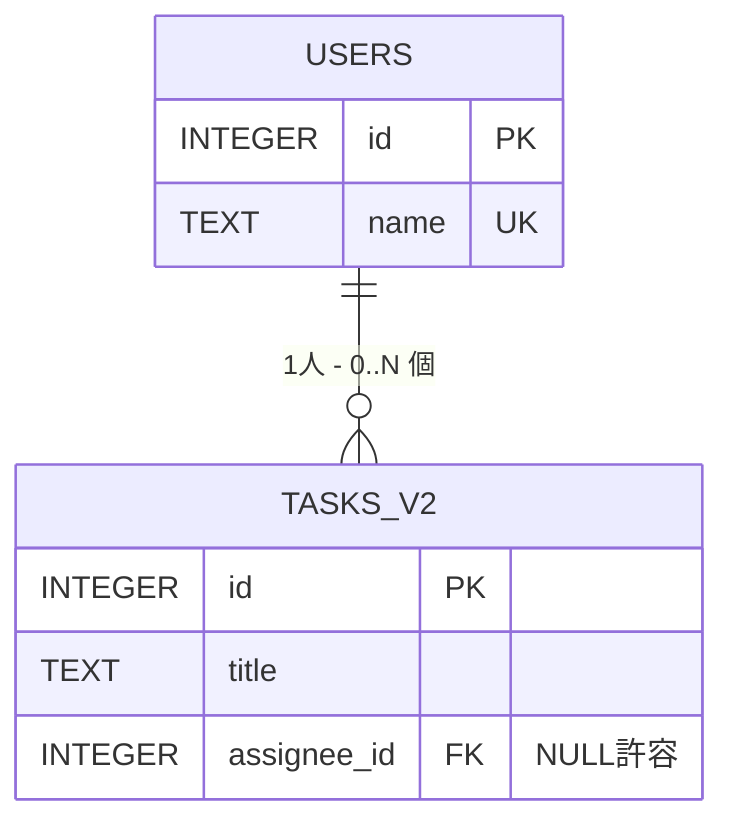

# Walkthrough — 重複・外部キー・サブクエリ・NULL を SQL で確かめる

> `00-concept/overview.md` の続き。「行と列で世界を表す」が何を解決するのか、**実コードを動かして** 体感する。SQLite 前提（life-editor が使っている）。書きながら手で叩いてみてほしい。

---

## 0. 学習目標（このセッションで腹落ちさせる 4 点）

| #   | 問い                                          | 到達基準                                                     |
| --- | --------------------------------------------- | ------------------------------------------------------------ |
| 1   | **「重複」とは何が起きること**？              | 改名 / typo / 表記揺れの 3 パターンを SQL で再現できる       |
| 2   | `WHERE col IN (SELECT...)` は何をしている？   | "集合に所属しているかテスト" と言語化できる                  |
| 3   | IN 以外で「複数の値にマッチさせる」書き方は？ | OR / JOIN / EXISTS の 3 つを使い分けの基準と一緒に説明できる |
| 4   | NULL を含む列は SELECT / WHERE で何が起きる？ | "三値論理" と "IS NULL を使う理由" を自分の言葉で説明できる  |

導入する新規用語は **4 個**: 外部キー / 参照整合性 / 三値論理 / サブクエリ（IN / EXISTS は SQL 演算子なので用語というより道具）

---

## 1. シナリオ

life-editor の `tasks` を題材にする。**最初は素朴な設計** から始めて、「壊れる例」を確認しながら直していく。

実行用 SQL: `code/walkthrough.sql`（このファイルの SQL を抜き出して順に実行できる）

```bash
# どこかで sqlite3 を立ち上げて流す
sqlite3 /tmp/learning.db < ~/dev/learning/data-modeling/01-implementation/code/walkthrough.sql
# またはインタラクティブに:
sqlite3 /tmp/learning.db
sqlite> .read ~/dev/learning/data-modeling/01-implementation/code/walkthrough.sql
```

---

## 2. Phase 1 — 重複ありの愚直設計

担当者の名前を **直接** タスクに持たせる:

```sql
CREATE TABLE tasks_v1 (
  id           INTEGER PRIMARY KEY,
  title        TEXT NOT NULL,
  assignee_name TEXT  -- ← これが今回の罠
);

INSERT INTO tasks_v1 (id, title, assignee_name) VALUES
  (1, 'Phase 0 整理',       'Taro'),
  (2, 'Phase 1 設計',       'Taro'),   -- Taro の情報が 2 行目にも書かれた
  (3, 'Phase 1 実装',       'Hanako'),
  (4, 'Phase 2 移行',       'taro'),   -- typo（小文字）— DB 的には別人扱い
  (5, 'Phase 2 リリース',   'Tarou');  -- Taro の改名後を勝手に書いてしまった
```

直感的には「同じ Taro が 4 行に書かれている」ように見えるが、DB から見ると **`Taro` / `taro` / `Tarou` は完全に別の値**。

---

## 3. Phase 2 — 重複の症状を SQL で観察

### 3.1 表記揺れの可視化

```sql
SELECT DISTINCT assignee_name FROM tasks_v1;
-- 結果:
-- Taro
-- Hanako
-- taro     ← 実は Taro と同じ人のつもり
-- Tarou    ← 実は Taro と同じ人のつもり
```

人間にとっては「全部 Taro」だが、DB は **文字列の完全一致でしか比較できない**。意味的同一性は知らない。

### 3.2 検索が壊れる

```sql
SELECT * FROM tasks_v1 WHERE assignee_name = 'Taro';
-- (1, 'Phase 0 整理', 'Taro')
-- (2, 'Phase 1 設計', 'Taro')
-- ↑ id=4 (typo) と id=5 (改名) が漏れる
```

### 3.3 改名のコストが O(N)

「Taro さんが改名して Tarou になりました」を反映するには:

```sql
UPDATE tasks_v1 SET assignee_name = 'Tarou' WHERE assignee_name = 'Taro';
-- ↑ typo の 'taro' は別文字列なので拾えない
-- ↑ 100 万行あれば 100 万行を書き換える必要がある
-- ↑ 途中でクラッシュしたら半分だけ更新された矛盾データができる
```

### **これが「重複が起こす問題」の正体**

| 症状           | 何が起きている                                                           |
| -------------- | ------------------------------------------------------------------------ |
| **表記揺れ**   | 同じ事実を複数箇所に書かせると、人間がブレを起こす                       |
| **検索漏れ**   | DB は意味的同一性を知らない。完全一致でしか引けない                      |
| **更新の重さ** | 「ある事実」を変えるのに、それを書いてある **すべての場所** を更新が必要 |
| **整合性破綻** | 更新中にクラッシュしたら、半分だけ更新された状態が残る                   |

→ これが overview.md §2.2 で言った「**同じ事実を 2 箇所に書かない**」の **動機側** の中身。

---

## 4. Phase 3 — 直す: users テーブル + 外部キー

担当者の **正本（マスタデータ）** を別テーブルに切り出し、tasks には **参照（ID）** だけ持たせる:

```sql
CREATE TABLE users (
  id    INTEGER PRIMARY KEY,
  name  TEXT NOT NULL UNIQUE  -- 同じ名前の重複を DB レベルで禁止
);

CREATE TABLE tasks_v2 (
  id           INTEGER PRIMARY KEY,
  title        TEXT NOT NULL,
  assignee_id  INTEGER REFERENCES users(id)  -- ← 外部キー
);

-- SQLite は外部キーをデフォルトで無効化している。明示的に有効化:
PRAGMA foreign_keys = ON;
```

### 4.1 用語: **外部キー (Foreign Key)**

`tasks_v2.assignee_id` は **users.id を参照する** という宣言。これにより:

- `users.id` に存在しない値を `tasks_v2.assignee_id` に入れようとするとエラー
- 「assignee_id=42 のユーザーは誰？」が **users 1 箇所を見れば分かる**
- 改名は `users` 1 行を更新するだけ。`tasks_v2` は触らない

### 4.2 用語: **参照整合性 (Referential Integrity)**

「外部キーで指している先が必ず存在する」状態。DB が **構造的に** これを保証してくれる。これが overview.md §2.2 の「整合性」の中で最も具体的な形。

### 4.3 データ移植

```sql
-- users マスタを 1 件ずつ作る
INSERT INTO users (id, name) VALUES
  (1, 'Taro'),
  (2, 'Hanako');

-- tasks_v2 は ID で参照する
INSERT INTO tasks_v2 (id, title, assignee_id) VALUES
  (1, 'Phase 0 整理',     1),
  (2, 'Phase 1 設計',     1),
  (3, 'Phase 1 実装',     2),
  (4, 'Phase 2 移行',     1),  -- もう typo 余地なし
  (5, 'Phase 2 リリース', 1);
```

### 4.4 改名は 1 行で終わる

```sql
UPDATE users SET name = 'Tarou' WHERE id = 1;
-- tasks_v2 は触らない。assignee_id=1 が指す先が変わるだけで、すべてのタスクが正しく "Tarou" を指す
```

---

## 5. Phase 4 — `IN (SELECT ...)` の正体（疑問への直接回答）

「Taro さんが担当しているタスクを全部出したい」を `IN` で書く:

```sql
SELECT * FROM tasks_v2
WHERE assignee_id IN (SELECT id FROM users WHERE name LIKE 'T%');
```

### 5.1 これは何をしている？

評価順序を分解すると:

```
ステップ 1: 内側の SELECT を実行
  SELECT id FROM users WHERE name LIKE 'T%';
  → {1}    ← "T で始まる" ユーザーの id の集合

ステップ 2: 外側の SELECT で IN を評価
  SELECT * FROM tasks_v2 WHERE assignee_id IN {1};
  → assignee_id が集合 {1} に入っている行を返す
```

### 5.2 `IN` の意味（言語化）

> **`x IN (集合)` は「x が集合に **所属している** か」をテストする演算子**

集合の作り方は何でもいい:

```sql
-- 値リストでも可
WHERE assignee_id IN (1, 2, 3);
-- サブクエリでも可
WHERE assignee_id IN (SELECT id FROM users WHERE active = 1);
```

「サブクエリ」とは **別の SELECT を式として埋め込んだもの**。SQL は集合に対する操作言語なので、**集合を返すクエリ** をそのまま **集合の値** として使える。これが宣言的クエリ（overview.md §2.3）の威力。

---

## 6. Phase 5 — IN 以外で「複数の値にマッチさせる」書き方

ユーザーの疑問: "IN 以外に複数表示するものはないのか" → **3 つある**。それぞれ意味が違う。

### 6.1 OR チェーン（書ける、けど推奨しない）

```sql
SELECT * FROM tasks_v2
WHERE assignee_id = 1 OR assignee_id = 2;
```

- **意味**: IN と等価
- **使う場面**: 値が 2-3 個と少なく、固定の時
- **問題**: 値が増えると冗長、サブクエリと組み合わせにくい

### 6.2 JOIN（最も使われる）

```sql
SELECT t.*
FROM tasks_v2 AS t
INNER JOIN users AS u ON u.id = t.assignee_id
WHERE u.name LIKE 'T%';
```

- **意味**: tasks_v2 の各行に **対応する users の行をくっつけて** から WHERE で絞る
- **IN との違い**:
  - IN: 「assignee_id が集合に入ってるか」だけテスト → tasks の列だけ取れる
  - JOIN: tasks と users **両方の列を同時に取れる** → 例: `SELECT t.title, u.name FROM ...`
- **使う場面**: 関連テーブルの **情報も同時に欲しい時**（タスク一覧 + 担当者名）

### 6.3 EXISTS（相関サブクエリ）

```sql
SELECT * FROM tasks_v2 AS t
WHERE EXISTS (
  SELECT 1 FROM users AS u WHERE u.id = t.assignee_id AND u.name LIKE 'T%'
);
```

- **意味**: tasks_v2 の各行 t について、「条件を満たす users の行が **1 つでも存在するか** 」をテスト
- **特徴**: 内側のサブクエリが **外側の t を参照する** → 各行ごとに評価される（"相関")
- **使う場面**: 複雑な条件で「存在の有無だけ」を知りたい時、IN だと書きにくい時

### 6.4 使い分けマトリクス

| やりたいこと                                                       | 推奨              |
| ------------------------------------------------------------------ | ----------------- |
| 「ID が固定リストに入っているか」だけ                              | `IN (1, 2, 3)`    |
| 「サブクエリの結果集合に入っているか」だけ、tasks の列しか要らない | `IN (SELECT ...)` |
| **関連テーブルの列も同時に欲しい**（タスク + 担当者名）            | `JOIN`            |
| 複雑な条件で「存在の有無だけ」                                     | `EXISTS`          |

---

## 7. Phase 6 — NULL の挙動（疑問への直接回答）

「assignee_id が **まだ決まっていない** タスク」をどう表すか？ → `NULL`。

### 7.1 NULL は「値が無い」というメタ状態

NULL は **値ではない**。「値が不明 / 未定 / 適用外」を表すマーカー。だから普通の比較ができない:

```sql
-- 直感に反する結果
SELECT * FROM tasks_v2 WHERE assignee_id = NULL;
-- → 0 行（何も返らない）

SELECT * FROM tasks_v2 WHERE assignee_id <> NULL;
-- → 0 行（何も返らない）

-- 正しい書き方
SELECT * FROM tasks_v2 WHERE assignee_id IS NULL;
-- → 担当者未定のタスクが返る
```

### 7.2 用語: **三値論理 (Three-Valued Logic)**

通常の論理は TRUE / FALSE の **二値**。SQL の論理は **三値**: TRUE / FALSE / **UNKNOWN(NULL)**。

```
NULL = 何か → UNKNOWN（TRUE でも FALSE でもない）
NULL <> 何か → UNKNOWN
NULL AND TRUE → UNKNOWN
NULL OR TRUE → TRUE  ← OR は片方が TRUE なら確定
```

WHERE 句は **TRUE の行だけ** 返す。UNKNOWN や FALSE は弾かれる。だから `= NULL` は何も返らない。

### 7.3 NULL に振り回されないための実務ルール

| シーン                           | 書き方                                                            |
| -------------------------------- | ----------------------------------------------------------------- |
| 「この列が NULL の行を取りたい」 | `WHERE col IS NULL`                                               |
| 「NULL でない行を取りたい」      | `WHERE col IS NOT NULL`                                           |
| 「NULL を 0 として扱いたい」     | `COALESCE(col, 0)` または `IFNULL(col, 0)`                        |
| 集計で NULL を除外したい         | `COUNT(col)` は **NULL 以外** をカウントする（`COUNT(*)` は全行） |

### 7.4 NULL を許すか / 許さないか は設計判断

```sql
-- NULL 許容（担当者未定タスクを認める）
assignee_id INTEGER REFERENCES users(id)

-- NULL 不許可（必ず誰かを割り当てる）
assignee_id INTEGER NOT NULL REFERENCES users(id)
```

life-editor の場合、「タスクを作った瞬間は担当者未定」が普通なので NULL 許容が自然。**ビジネスルール側の判断**。

---

## 8. ER 図（ミニ）

ここまでの構造を絵にするとこうなる:



- `||` = ちょうど 1
- `o{` = 0 個以上（タスクが 1 個もない人もいる、担当者未定タスクもある）

「1 対 N」と読む。USERS が "1" 側、TASKS が "N" 側。

これだけの図でも、テーブル定義より **関係性が一目で分かる**。これが ER 図を描く動機。

---

## 9. このセッションで身についたか確認（次回までの宿題）

実行は次回。今読みながら考えてみるだけで OK:

1. (Phase 2 復習) `tasks_v1` の表記揺れを直すには SQL 1 文でどう書く？（複数アプローチ可）
2. (Phase 5 応用) 「自分しか担当していないタスクが 1 つでもあるユーザー」を取りたい。IN / JOIN / EXISTS のどれで書くべき？理由は？
3. (Phase 7 応用) `assignee_id NOT NULL` にした場合、「担当者未定」をどう表現するか？ 設計案を 2 つ出して比較してみて

回答は次セッションで `quiz/01-recall-basic.md` と `.answer.md` に整理する。

---

## 10. 次のステップ

- [ ] `code/walkthrough.sql` を実際に SQLite で実行してみる（手で叩く = Generation Effect）
- [ ] 次セッション: 第 1 / 第 2 / 第 3 正規形の話 → `00-concept/key-terms.md` を埋める
- [ ] その先: `02-comparison/services-overview.md` で MongoDB / Neo4j と並べて「整合性をどこまで追うか」のスペクトラムを見る
